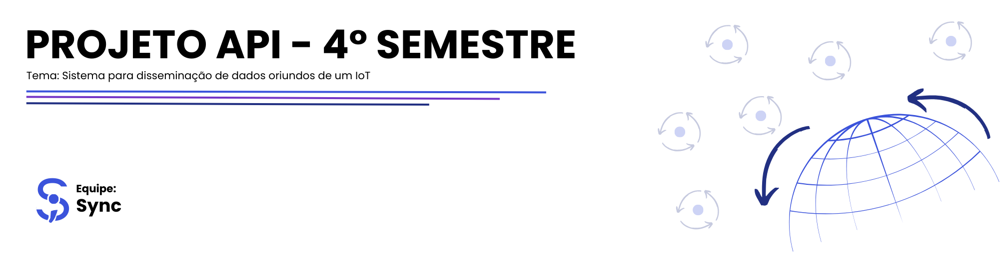
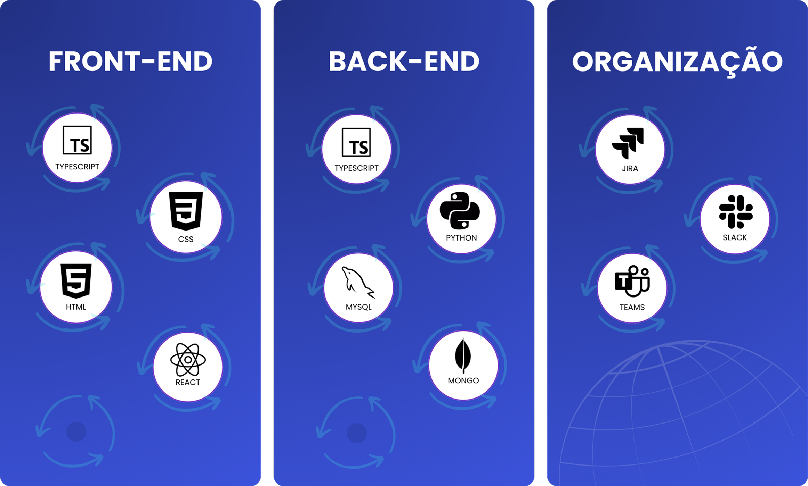

<h2 id='topo'></h2>

<a href="#objetivo"> 🎯 Objetivo </a> |
<a href="#proposta"> 📧 Proposta de Solução </a> |
<a href="#requisitos-funcionais"> 📚 Requisitos Funcionais </a> |
<a href="#requisitos-nao-funcionais"> 📚 Requisitos Não Funcionais </a> |
<a href="#product-backlog"> 📖 Product Backlog </a> |
<a href="#dor"> DoR </a> |
<a href="#dod"> DoD </a> |
<a href="#sprints"> 📌 Sprints </a> |
<a href="#tecnologias"> 💻 Tecnologias </a> |
<a href="#padroes-de-commit"> 📨 Padrões de Commit </a> |
<a href="#membros"> 👥 Membros </a> 

 

<h2 id='objetivo'> 🎯 Objetivo </h2>
Este projeto tem como objetivo desenvolver um sistema de monitoramento ambiental para a Tecsus, permitindo a coleta, processamento e visualização de dados meteorológicos em tempo real. A plataforma facilitará a análise de informações como temperatura, umidade, pressão, velocidade do vento e índice pluviométrico, promovendo a conscientização ambiental e auxiliando na prevenção de desastres naturais.

 

<h2 id='proposta'> 📧 Proposta de Solução </h2>

Nossa proposta é criar um sistema eficiente e acessível, integrando sensores IoT a uma plataforma moderna para exibição e análise de dados.

✅ Arquitetura Escalável: Utilizaremos uma estrutura robusta para garantir a recepção e o processamento eficiente dos dados enviados pelas estações meteorológicas.

📊 Dashboards Interativos: O sistema apresentará gráficos e relatórios em tempo real, permitindo a análise detalhada dos dados coletados.

🚨 Geração de Alertas: Implementaremos um sistema de notificações automáticas para eventos meteorológicos críticos, auxiliando na tomada de decisões.

🎓 Engajamento Educacional: A plataforma contará com materiais explicativos sobre os conceitos meteorológicos, incentivando a aprendizagem baseada em problemas para estudantes do ensino médio.

 

<h2 id='requisitos-funcionais'> 📚 Requisitos Funcionais </h2>

| Número | Descrição |
| ------ | --------------------- |
| 1 | Modelo de Dados Dinâmico: Capacidade de receber e registrar estações meteorológicas equipadas com diversos tipos de sensores.  |
| 2 | CRUD para Estações, Parâmetros, Alertas e Usuários: Funcionalidades completas de criação, leitura, atualização e exclusão.  |
| 3 | Recepção de Dados: Processamento e armazenamento dos dados enviados pelas estações meteorológicas.  |
| 4 | Dashboards: Visualização interativa dos parâmetros meteorológicos.  |
| 5 | Geração de Alertas: Criação automática de notificações baseadas em condições meteorológicas específicas.  |
| 6 | Desenvolvimento de Datalogger: Implementação de um datalogger para registrar dados em uma estação meteorológica.   |
| 7 | Montagem de Estação Meteorológica: Construção física de uma estação meteorológica com os componentes necessários.   |
| 8 | Tutorial Educativo: Desenvolvimento de um guia explicativo sobre o significado de cada parâmetro meteorológico medido.   |

 

<h2 id='requisitos-nao-funcionais'> 📚 Requisitos Não Funcionais </h2>

| Número | Descrição |
| ------ | --------------------- |
| 1 | Experiência do Usuário (UX): Design dos dashboards deve priorizar a usabilidade e a estética para melhor engajamento dos usuários. |
| 2 | Engajamento Estudantil: Fomentar o interesse dos alunos do ensino médio pelo estudo através da aplicação prática de conceitos em um contexto de aprendizado baseado em problemas.  |
| 3 | Documentação de APIs: Elaboração detalhada da documentação para todas as rotas da API, incluindo exemplos de uso.  |
| 4 | Pipeline de Integração Contínua (IC): Implementação de um pipeline de IC para automação de testes e validações de código.  |
| 5 | Deploy Automático: Configuração de processos automáticos de deploy para garantir atualizações consistentes do sistema.  |

 

<h2 id='product-backlog'> 📖 Product Backlog </h2>

<table>
  <thead>
    <tr align="center">
      <th>Rank</th>
      <th>Prioridade</th>
      <th>User Story</th>
      <th>Planning Poker</th>
      <th>Sprint</th>
      <th>Requisitos Funcionais</th>
    </tr>
  </thead>
  <tbody>
    <tr align="center"><td>1</td><td>ALTA</td><td>Como administrador, quero que o sistema suporte um modelo de dados dinâmico e permita o cadastro de estações meteorológicas, garantindo flexibilidade na gestão e registro dessas informações.</td><td>3</td><td>1</td><td>1</td></tr>
    <tr align="center"><td>2</td><td>ALTA</td><td>Como administrador, quero cadastrar novos parâmetros meteorológicos para garantir que todas as medições necessárias sejam registradas corretamente.</td><td>3</td><td>1</td><td>2</td></tr>
    <tr align="center"><td>3</td><td>ALTA</td><td>Como administrador, quero cadastrar alertas meteorológicos para identificar condições climáticas críticas.</td><td>3</td><td>1</td><td>2</td></tr>
    <tr align="center"><td>4</td><td>ALTA</td><td>Como administrador, quero cadastrar novos usuários para que possam acessar o sistema conforme suas permissões.</td><td>3</td><td>1</td><td>2</td></tr>
    <tr align="center"><td>5</td><td>ALTA</td><td>Como administrador, quero editar as informações de uma estação meteorológica para manter os dados sempre atualizados.</td><td>3</td><td>1</td><td>2</td></tr>
    <tr align="center"><td>6</td><td>ALTA</td><td>Como administrador, quero editar os parâmetros meteorológicos para corrigir informações ou ajustar unidades de medida.</td><td>3</td><td>1</td><td>2</td></tr>
    <tr align="center"><td>7</td><td>ALTA</td><td>Como administrador, quero editar alertas meteorológicos para ajustar suas condições de ativação e notificação.</td><td>3</td><td>1</td><td>2</td></tr>
    <tr align="center"><td>8</td><td>ALTA</td><td>Como administrador, quero editar as informações de um usuário para corrigir ou alterar permissões.</td><td>3</td><td>1</td><td>2</td></tr>
    <tr align="center"><td>9</td><td>ALTA</td><td>Como usuário, quero visualizar uma lista de todas as estações cadastradas no sistema.</td><td>3</td><td>1</td><td>2</td></tr>
    <tr align="center"><td>10</td><td>ALTA</td><td>Como administrador, quero visualizar uma lista de parâmetros meteorológicos cadastrados para acompanhar e gerenciar as medições do sistema.</td><td>3</td><td>1</td><td>2</td></tr>
    <tr align="center"><td>11</td><td>ALTA</td><td>Como administrador, quero visualizar uma lista de alertas meteorológicos cadastrados para gerenciar notificações de eventos climáticos críticos.</td><td>3</td><td>1</td><td>2</td></tr>
    <tr align="center"><td>12</td><td>ALTA</td><td>Como administrador, quero visualizar uma lista de usuários cadastrados para gerenciar acessos e permissões no sistema.</td><td>3</td><td>1</td><td>2</td></tr>
    <tr align="center"><td>13</td><td>ALTA</td><td>Como administrador, quero ativar e desativar estações meteorológicas conforme necessário.</td><td>3</td><td>1</td><td>2</td></tr>
    <tr align="center"><td>14</td><td>ALTA</td><td>Como administrador, quero excluir estações meteorológicas conforme necessário.</td><td>3</td><td>1</td><td>2</td></tr>
    <tr align="center"><td>15</td><td>ALTA</td><td>Como administrador, quero excluir parâmetros meteorológicos que não sejam mais necessários para manter o sistema organizado.</td><td>3</td><td>1</td><td>2</td></tr>
    <tr align="center"><td>16</td><td>ALTA</td><td>Como administrador, quero excluir alertas que não sejam mais necessários para manter o sistema atualizado.</td><td>3</td><td>1</td><td>2</td></tr>
    <tr align="center"><td>17</td><td>ALTA</td><td>Como administrador, quero excluir usuários inativos ou desnecessários para manter a base de dados organizada.</td><td>3</td><td>1</td><td>2</td></tr>
    <tr align="center"><td>18</td><td>ALTA</td><td>Como administrador, quero controlar o acesso ao sistema definindo permissões para diferentes usuários.</td><td>2</td><td>1</td><td>2</td></tr>
    <tr align="center"><td>19</td><td>MÉDIA</td><td>Como sistema, quero receber dados das estações meteorológicas em tempo real.</td><td>5</td><td>2</td><td>3</td></tr>
    <tr align="center"><td>20</td><td>MÉDIA</td><td>Como sistema, quero processar os dados recebidos para calcular médias horárias e diárias.</td><td>8</td><td>2</td><td>3</td></tr>
    <tr align="center"><td>21</td><td>MÉDIA</td><td>Como sistema, quero armazenar os dados recebidos das estações meteorológicas de forma otimizada para suportar grandes volumes de informações.</td><td>5</td><td>2</td><td>3</td></tr>
    <tr align="center"><td>22</td><td>MÉDIA</td><td>Como administrador, quero monitorar o funcionamento das estações meteorológicas em tempo real.</td><td>8</td><td>2</td><td>3</td></tr>
    <tr align="center"><td>23</td><td>MÉDIA</td><td>Como usuário, quero receber notificações em caso de eventos meteorológicos extremos.</td><td>3</td><td>2</td><td>5</td></tr>
    <tr align="center"><td>24</td><td>MÉDIA</td><td>Como sistema, quero registrar automaticamente os dados coletados pelas estações meteorológicas em um datalogger, para garantir a persistência e integridade das informações.</td><td>5</td><td>2</td><td>6</td></tr>
    <tr align="center"><td>25</td><td>MÉDIA</td><td>Como administrador, quero montar e configurar a estação meteorológica com sensores para coletar dados ambientais de forma precisa.</td><td>8</td><td>2</td><td>7</td></tr>
    <tr align="center"><td>26</td><td>MÉDIA</td><td>Como usuário, quero acessar um tutorial sobre os conceitos meteorológicos apresentados.</td><td>8</td><td>2</td><td>8</td></tr>
    <tr align="center"><td>27</td><td>BAIXA</td><td>Como usuário, quero acessar dashboards interativos com os dados coletados pelas estações.</td><td>8</td><td>3</td><td>4</td></tr>
    <tr align="center"><td>28</td><td>BAIXA</td><td>Como usuário, quero filtrar os dados exibidos no dashboard por data, para visualizar informações específicas de um período determinado.</td><td>3</td><td>3</td><td>4</td></tr>
    <tr align="center"><td>29</td><td>BAIXA</td><td>Como administrador, quero gerar relatórios detalhados sobre as condições meteorológicas registradas.</td><td>5</td><td>3</td><td>4</td></tr>
    <tr align="center"><td>30</td><td>BAIXA</td><td>Como usuário, quero acessar um histórico de medições para comparar variações ao longo do tempo.</td><td>5</td><td>3</td><td>3</td></tr>
    <tr align="center"><td>31</td><td>BAIXA</td><td>Como administrador, quero que o sistema registre logs de atividades para segurança.</td><td>8</td><td>3</td><td>4</td></tr>
    <tr align="center"><td>32</td><td>BAIXA</td><td>Como usuário, quero alterar minha senha para garantir a segurança da minha conta.</td><td>3</td><td>3</td><td>2</td></tr>
    <tr align="center"><td>33</td><td>BAIXA</td><td>Como usuário, quero poder recuperar minha senha caso eu a esqueça, para continuar acessando o sistema.</td><td>3</td><td>3</td><td>2</td></tr>
  </tbody>
</table>

 

<h2 id='dor'> DoR (Definitions of Ready) </h2>

### User Stories
- Definidas e compreendidas por todos.
- Pequenas o suficiente para serem feitas em uma sprint.

### Critério de Aceitação
- Mensurável e testável.
- Descreve claramente quando a funcionalidade está completa.

### Tarefas
- Identificadas e documentadas para cada User Story.
- Cada tarefa possui um responsável designado.

### Modelo de Dados
- Definido e documentado.
- Campos, tipos de dados e relações claramente especificados.

 

<h2 id='dod'> DoD (Definition of Done) </h2>

### Código
- Implementa todos os critérios de aceitação.
- Todos os testes implementados e executados com sucesso.

### Commit
- Documentados com mensagens claras e descritivas.
- Seguem o padrão de nomenclatura acordado pela equipe.

### Mockups
- Mockups na interface funcionam conforme esperado.
- Experiência do usuário corresponde aos critérios definidos.

### Guia de Instalação
- Detalha todos os passos para configuração e instalação.
- Inclui requisitos de sistema, dependências e configurações de software/hardware.

  

<h2 id='sprints'> 📌 Sprints </h2>

<table>
  <thead>
    <tr align="center">
      <th>Sprints</th>
      <th>Data de Início</th>
      <th>Data de Término</th>
      <th>Documentos</th>
      <th>Status</th>
    </tr>
  </thead>
 <tbody>
  <tr align="center">
    <td>01</td>
    <td>10/03/2025</td>
    <td>30/03/2025</td>
    <td><a href="https://github.com/Sync-FATEC/API-2025.1-4SEM/tree/main/sprints/sprint01/sprint01.md">Relatório</a></td> 
    <td>🔄</td>
  </tr>
  <tr align="center">
    <td>02</td>
    <td>07/04/2025</td>
    <td>27/04/2025</td>
    <td></td> 
    <td>🔄</td>
  </tr>
  <tr align="center">
    <td>03</td>
    <td>05/05/2025</td>
    <td>25/05/2025</td>
    <td></td> 
    <td>🔄</td>
  </tr>
</tbody>
</table>

<h2>:movie_camera: MVP </h2>

<h3>Administrador</h3>

<h3>Cliente</h3>

 

<h2 id='tecnologias'> 💻 Tecnologias </h2>

 

<h2 id='padroes-de-commit'> 📨 Padrões de Commit </h2>

 

<h2 id='membros'> 👥 Membros </h2>

| Foto | Nome | Função | Github | Linkedin |
| :---------: | :---------: | :---------------------: | :-----------------: | :-------: |
|  | João Gabriel Solis | Scrum Master |  |  |
|  | Ana Laura Moratelli | Product Owner |  |  |
|  | Ana Clara Marques | Desenvolvedora |  |  |
|  | Erik Yokota | Desenvolvedor |  |  |
|  | Filipe Colla | Desenvolvedor |  |  |
|  | Kauê Francisco | Desenvolvedor |  |  |

<a href='#topo'> Voltar ao topo </a>
